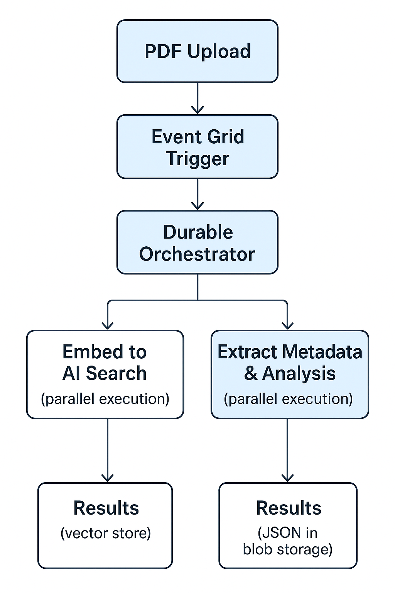

# PDF Processing Pipeline with Azure Functions

A serverless PDF processing pipeline that uses Azure Functions, Durable Functions, and Azure AI services to process PDFs in parallel, extract embeddings, and generate metadata.

---


### Components Used

- **Azure Storage**: PDF uploads and results storage
- **Azure Functions**: Event-driven PDF processing using Durable Functions
- **Azure AI Search**: Vector storage for embeddings
- **Azure OpenAI**: Text embeddings generation
- **Event Grid**: Triggers function execution on new PDF uploads
- **Application Insights**: Monitoring and logging

### Processing Flow



## Prerequisites
Before you start, you should have the following tools installed:


1. **Azure Account** (create free account with $200 credit)
2. **Terraform** >= 1.5
3. **Azure CLI** (`az`)
4. **Python** 3.11+
5. **Git** 
6. **GitHub Account** (for Actions CI/CD - optional)

### Verify Prerequisites
Can verify you have the correct tools installing by checking its versions
```bash
terraform --version
az --version
python --version
git --version
```


## Setup Instructions

### Step 1: Clone Repository
```bash
git clone <repository-url>
cd <repository-name>
```

### Step 2: Azure Authentication

Authenticate with Azure using the CLI:
```bash
az login
az account set --subscription "<your-subscription-id>"
```

Verify authentication:
```bash
az account show
```

### Step 3: Terraform Configuration

Navigate to the Terraform directory:
```bash
cd terraform
```

Create your local variables file:
```bash
cp terraform.tfvars.example terraform.tfvars
```

Edit `terraform.tfvars` with your desired values:
```bash
environment                = "dev"  # or "staging", "prod"
project_name               = "pdf-processor"
location                   = "UK South"  # Change as needed
enable_eventgrid_subscription = false  # IMPORTANT: Keep false initially
```

### Step 4: Initialize Terraform
```bash
terraform init
```

This downloads the required Azure provider and initialises the working directory.

### Step 5: Plan Infrastructure (Phase 1 - WITHOUT Event Grid)
```bash
terraform plan -out=tfplan
```

Review the planned resources. You should see:
- Resource Group
- Storage Account & Containers
- OpenAI Service & Embedding Model
- Document Intelligence Service
- AI Search Service
- Application Insights & Log Analytics
- Function App Service Plan
- Linux Function App
- **NO Event Grid subscription** (because `enable_eventgrid_subscription = false`)

### Step 6: Apply Infrastructure (Phase 1)
```bash
terraform apply tfplan
```

After successful deployment, note the outputs:
```bash
terraform output
```

SAVE THESE VALUES - will need them for the function app configuration.

### Step 7: Deploy Function App Code

Before enabling Event Grid, you have to deploy the function app code. This prevents the Event Grid trigger from firing before the function is ready.
```bash
cd ../function_app
pip install -r requirements.txt
cd ..
```


### Step 8: Enable Event Grid (Phase 2)

Update `terraform/terraform.tfvars`:
```bash
enable_eventgrid_subscription = true
```

Plan and apply:
```bash
cd terraform
terraform plan -out=tfplan
terraform apply tfplan
```

This creates the Event Grid subscription that will trigger your function on PDF uploads.


## Configuration

### Customising Deployment

Edit `terraform/terraform.tfvars`:
```bash
# Change container names if you would like
pdf_uploads_container_name = "my-pdf-uploads"
pdf_results_container_name = "my-pdf-results"

# Change AI Search tier if 
ai_search_sku = "basic"

# Adjust logging retention
log_retention_days = 90

# Change Python version
python_version = "3.11"
```

Then reapply:
```bash
terraform apply
```

---

## Deployment

### Local Testing

1. **Set up local environment**:
```bash
cd function_app
python -m venv venv
source venv/bin/activate
pip install -r requirements.txt
```

2. **Configure local settings**:

Update `function_app/local.settings.json` with values from `terraform output`.

3. **Run locally**:
```bash
func start
```

### CI/CD Deployment with GitHub Actions

1. **Create GitHub Secrets**:

In your GitHub repo settings, go to Secrets and variables -> Actions -> New repository secret and add these secrets:

```bash
AZURE_FUNCTIONAPP_NAME          = terraform output function_app_name
AZURE_FUNCTIONAPP_PUBLISH_PROFILE = #(see below)
AZURE_STORAGE_CONNECTION_STRING = terraform output storage_connection_string
```


**To get the publish profile**:

You have 2 methods, either:
```bash
az functionapp deployment list-publishing-credentials \
  --name <function-app-name> \
  --resource-group <resource-group-name> \
  --query publishingProfile
```
**OR**

Go to Azure Portal -> Your Function App -> Get publish profile (will download) -> Open it and then follow next step


Copy the entire XML output and paste it as `AZURE_FUNCTIONAPP_PUBLISH_PROFILE` GitHub secret.

1. **Push to main branch**:
```bash
git push
```

GitHub Actions automatically:
- Builds the function app package
- Uploads it as an artifact
- Deploys to Azure
- Uploads test PDFs to the container

---

## GitHub Actions Setup

The `.github/workflows/deploy.yml` workflow handles:

1. **Build Phase**:
   - Checkout code
   - Set up Python 3.11
   - Create deployment zip
   - Upload as artifact

2. **Deploy Phase**:
   - Download artifact
   - Deploy to Azure Functions

To enable/disable the PDF upload step, edit `.github/workflows/deploy.yml`.

---

## Testing
In Azure Portal:
- Go to Function App → Monitoring → Log stream

### Test: Upload a PDF
```bash
az storage blob upload \
  --account-name <storage-account-name> \
  --container-name pdf-uploads \
  --name test.pdf \
  --file /path/to/test.pdf \
  --account-key <storage-key>
```

### Test: Check Processing Status
```bash
curl "https://<function-app-url>/api/processingStatus"
```

### Test: View Results
```bash
az storage blob list \
  --account-name <storage-account-name> \
  --container-name pdf-results \
  --account-key <storage-key>
```